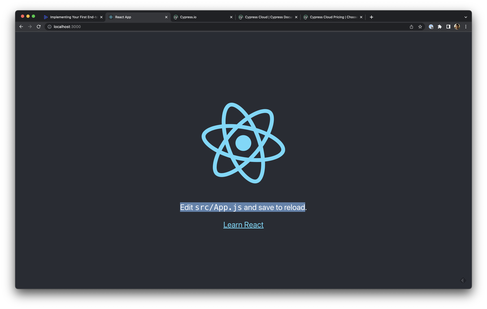
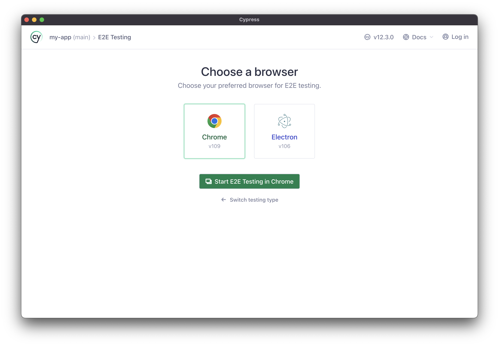
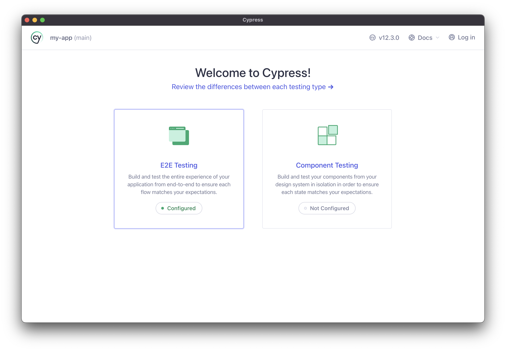
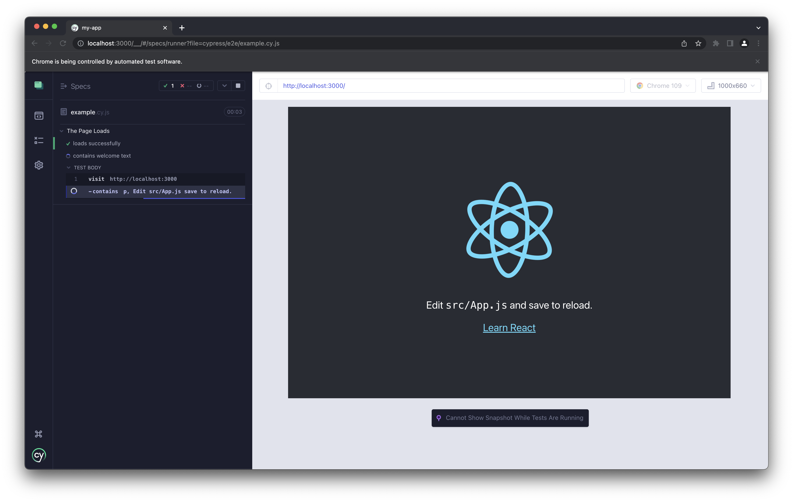
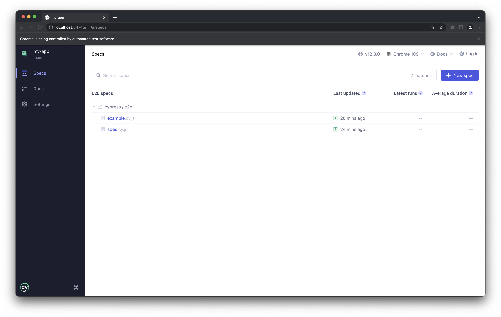

# My App

Basic React web app (generated using [Create React App](https://create-react-app.dev/) template) with the [Cypress e2e testing framework](https://www.cypress.io/) installed

## Environment

- nodeJS v18.16.1
- npm v9.5.1

## Prerequisites
- Install [nodeJS](https://nodejs.org/dist/v18.13.0/node-v18.13.0.pkg)

## Setup

- Open a terminal in this directory e.g. `cd /Downloads/my-app/`
-  `npm install` Run in terminal to install libraries and dependencies for this project 

## Usage

### Launch web app

- `npm run start` Run in terminal to run  the web app in the development mode. 
- [http://localhost:3000](http://localhost:3000) to view it in your local browser.
- Note. The page will reload when you make changes.
Note. you need to do this before running e2e tests too



### Run e2e tests

- `npm run e2e-tests` Run in terminal 

(or `cypress open`)

- To run e2e Cypress UI tests either run the following command 


Then choose the spec file in the Cypress UI and run it

## Guide

### Adding Cypress e2e UI testss

Add a file in the cypress/e2e folder e.g. `myFeature.cy.js` 

```
describe('The Page Loads', () => {
    it('loads successfully', () => {
        cy.visit('http://localhost:3000')
    })

    it('contains welcome text', () => {
        cy.visit('http://localhost:3000')
        cy.contains('p', 'Edit src/App.js save to reload.')
    })
})
```
Use `npm run e2e-tests` to open the Cypress Browser to run the tests

TODO 
- [ ] Add more HTML tags i.e. UI elements to the `src/App.js `
- [ ] Learn the different Cypress syntax from their website to find HTML elements by id (`cy-data`) and assert them
- [ ] Best practices for organising e.g Page Object Pattern

### Screenshots









### Changing the UI

- To edit the text see `src/App.js` this is a UI component built (written in jsx language) using the React web framework for the intro page 
- You can add other HTML UI elements here such as `<button>` `<p>` etc
- See [React hello world](https://reactjs.org/docs/hello-world.html) for more info 

```function App() {
  return (
    <div className="App">
      <header className="App-header">
        
        <p>
          Edit <code>src/App.js</code> and save to reload.
        </p>
        <a
          className="App-link"
          href="https://reactjs.org"
          target="_blank"
          rel="noopener noreferrer"
        >
          Learn React
        </a>
      </header>
    </div>
  );
```
### Troubleshooting

- Delete `node_modules` folder before running `npm install`

## Links

https://docs.cypress.io/guides/end-to-end-testing/writing-your-first-end-to-end-test

https://docs.cypress.io/guides/references/best-practices

https://blog.openreplay.com/implementing-your-first-end-to-end-tests-in-react-using-cypress/

https://www.w3schools.com/html/html_forms.asp

https://www.browserstack.com/guide/cypress-page-object-model

https://www.cypress.io/blog/2019/01/03/stop-using-page-objects-and-start-using-app-actions/

https://codefrontend.com/reactjs-redirect-to-url/
